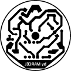

# **Úvod**

Svetlo sa skladá z dvoch častí: biele zábleskové (stroboskopové) a biele
pozičné svetlo. Je určené na smerovku lietadla. Výkon zábleskovej časti
je približne $20W$ a výkon pozičnej časti je približne
$3W$. Obe časti sa zapínajú samostatne, pripojením napájacieho
napätia na vstup. Svetlo sa skladá z troch bielych LED čipov, každý s
výkonom $10W$. Dva tvoria zábleskovú časť a tretí pozičnú.

Riadiacu časť zábleskového svetla tvorí čip PICAXE 08M2+.

Svetlo je určené na napájanie z 12V zdroja.

# **Technický popis**

Pozičná a záblesková časť sú nezávislé, zdieľajú iba spoločný jeden pól
(zem). Zábleskovú časť spína programovateľný čip PICAXE 08M2+ cez
tranzistor IRF 530N. Programovateľný čip je napájaný cez lineárny
napäťový menič 7805. Ku vstupu zábleskovej časti je paralelne pripojený
elektrolytický kondenzátor s kapacitou 1000μF na pokrytie napäťových
špičiek vzniknutých pri zablysnutí svetla. Maximálne napätie pre tento
kondenzátor je 16V, čo určuje maximálne napájacie napätie svetla.

Súčiastky sú osadené na plošnom spoji hrúbky 1,5mm s hrúbkou medenej
vodivej časti 35μm.

Celé svetlo je zaliate v epoxidovej zalievacej živici RIVERTABLE od
Havel composites.

Zo svetla vychádza 7 káblov:

  | **farba** | **hrúbka** |            **význam**            |
  |-----------|------------|----------------------------------|
  |  čierna   |   hrubý    |    spoločná zem pre napájanie    |
  |  červená  |   hrubý    |  kladný pól pre pozičné svetlo   |
  |   žltá    |   hrubý    | kladný pól pre zábleskové svetlo |
  |   modrá   |   hrubý    |      synchronizačný kontakt      |
  |  čierna   |   tenký    |    zem pre programovací kábel    |
  |  červená  |   tenký    |    RxD pre programovací kábel    |
  |   biela   |   tenký    |    TxD pre programovací kábel    |

Synchronizačný kontakt je pripravený na pripojenie 12V napätie. K PICAXE
je pripojený cez napäťový delič (dva rezistory s odpormi 100k a 47k) na
analógový vstup, takže v prípade potreby sa dajú záblesky synchronizovať
s ostatnými svetlami na lietadle.

Zo svetla sú vyvedené programovacie kontakty, takže je možné kedykoľvek
preprogramovať spôsob blikania (frekvecia, počet zábleskov, \...).

Napäťový menič 7805 v zábleskovej časti je chránený pred prepólovaním
jednou diódou 1N4148, a keďže svetlá sú LED, takže diódy, tak by mal byť
pred prepolóvaním chránený celý obvod, ale nebolo to testované.

# **Výroba**

Plošný spoj bol odmastený, obrúsený jemným šmirgľom. Na leský papier bol
na laserovej tlačiarni vytlačený plošný spoj. Ten bol potom na plošný
spoj prežehlený žehličkou nastavenou na "dve bodky". Plošný spoj bol
potom vyleptaný. Leptanie trvalo približne polhodinu. Nasledovalo umytie
pod tečúcou vodou a natretie pájkovateľným lakom. Do plošného spoja boli
navŕtané diery priemeru 0,8mm a 1mm na súčiastky.

Plošný spoj bol následne osadený súčiastkami. Aby mohol programovateľný
čip ísť na druhú stranu plošného spoja, boli mu ohnuté vývody na druhú
stranu, takže je vrchnou časťou pri plošnom spoji.

Výkonové LED sú umiestnené na pásikoch z plošného spoju, ktoré sú k sebe
prilepené epoxidom, aby LEDky dokopy tvorili rovnostranný trojuholník.
Pásiky sú k plošnému spoju pripájkované.

Výrobok po zaliaty v zalievacej epoxidovej živici. Aj napriek
naseparovaniu formy nešiel z formy odlepiť inak ako po rozrezaní. Z
výrobku bolo tiež treba odbrúsiť plnič, ktorý sa odlepil od formy a
prilepil na výrobok. Výrobok bol nakoniec vyleštený a nastriekaný
priehľadným UV odolným lakom.

# **Technické parametre**

  |     **Parameter**       |   **Označenie**   |            **Hodnota**             |                 **Poznámka**                 |
  |-------------------------|-------------------|------------------------------------|----------------------------------------------|
  | Hmotnosť svetla         |        $m$        |           $80g$                    |                                              |
  | Priemer svetla          |        $d$        |       $44mm$                       |                                              |
  | Výška svetla            |        $h$        |       $40mm$                       |                                              |
  | Priemerný prúd          |        $I$        | $0,22A\, @12V$                     |                                              |
  | **Zábleskové svetlo**   |                   |                                    |                                              |
  | Min. napájacie napätie  | $V_{strobe\,min}$ |           $10V$                    |  kvôli $V_{forward}=9.5V$ pre LED            |
  | Max. napájacie napätie  | $V_{strobe\,max}$ |           $16V$                    |  kvôli $V_{max}=16V$ pre kondenzátor         |
  | Špičkový prúd           |   $I_{strobe}$    | $0,9A\, @12V$                      |                                              |
  | Špičkový výkon          |   $P_{strobe}$    |  $10,8W\, @12V$                    |                                              |
  | Strieda (Duty cycle)    |        $D$        |           $\approx 7 \%$           |                                              |
  |  **Pozičné svetlo**     |                   |                                    |                                              |
  | Min. napájacie napätie  |  $V_{pos\,min}$   |           $10V$                    |  kvôli $V_{forward}=9.5V$ pre LED            |
  | Max. napájacie napätie  |  $V_{pos\,max}$   |           $16V$                    |  kvôli $P_{max}=2W$ pre odpory               |
  | Prúd                    |     $I_{pos}$     | $0,15A\, @12V$                     |                                              |
  | Výkon                   |     $P_{pos}$     |  $1,8W\, @12V$                     |                                              |

# **Poznámky a vylepšenia do búducnosti**

-   väčšina odporov môže mať menší maximálny stratový výkon
-   prerobiť plošný spoj na správne veľkosti odporov
-   pridať na plošný spoj na napäťový delič na synchronizáciu s
    ostatnými svetlami
-   pri zalievaní lepšie vyrovnať plošný spoj, keďže teraz nebol rovno

# Plošák a schéma

